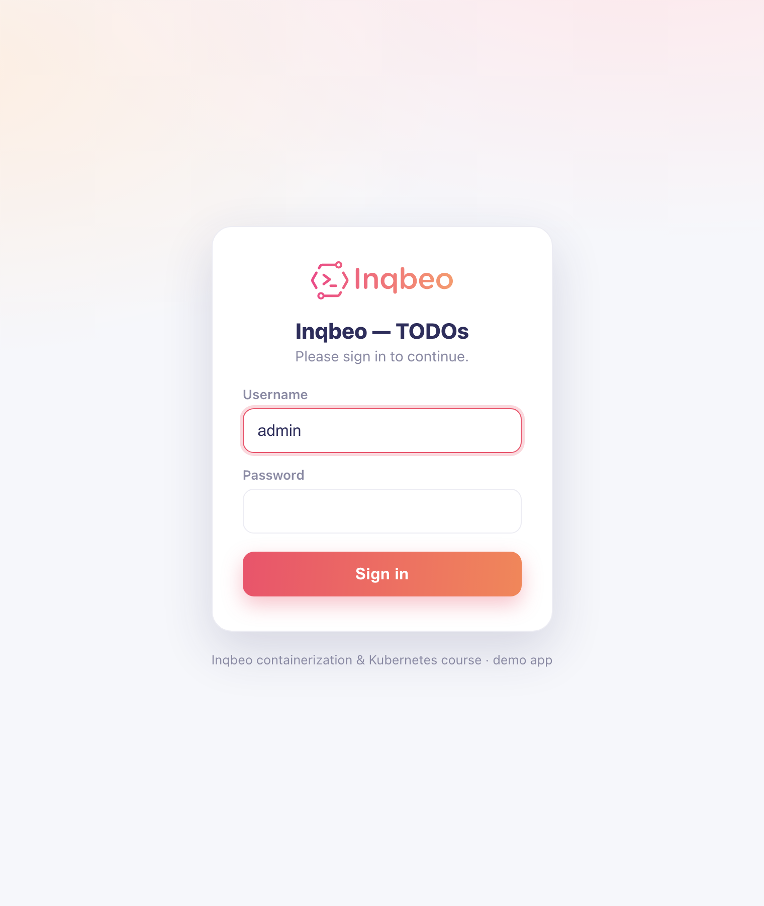
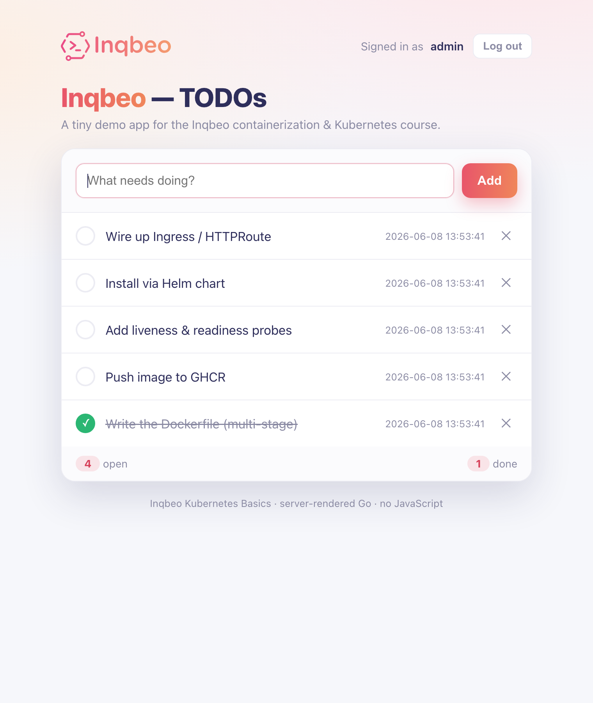
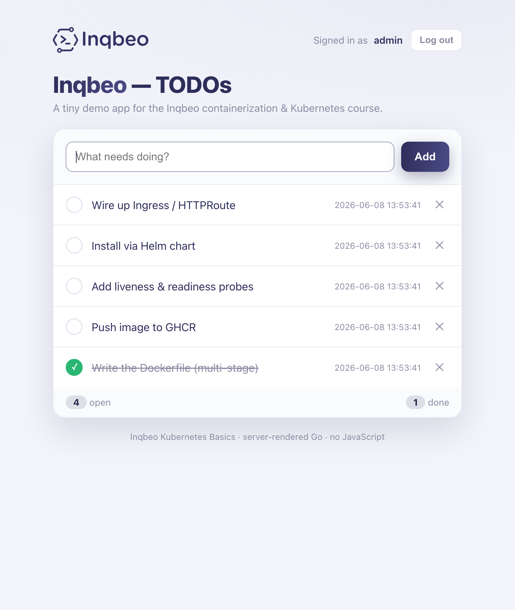
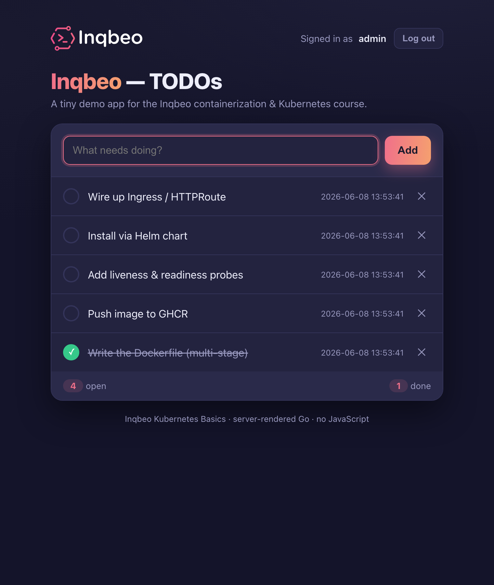

# todo — a tiny demo app for containers & Kubernetes

[](https://github.com/inqbeo/containerization-demo-webapp/actions/workflows/ci.yml)
[](LICENSE)

A minimal, server-rendered TODO web application written in Go. It is the
**running example** used throughout the **Inqbeo containerization & Kubernetes
basics course**: the same app is built into an image on day 1 and deployed —
unchanged — to Kubernetes on day 2.

> **This is teaching material, not a product.** Every feature exists to make one
> concept tangible in class. Readability beats cleverness on purpose — the code
> gets read aloud and projected on a wall. It is intentionally *not* production
> hardened (no CSRF protection, no rate limiting, Basic session handling only).

Module path: `github.com/inqbeo/todo`

<p align="center">
  
  
</p>

---

## What it demonstrates

| Feature | Concept in the course |
|---|---|
| Single static Go binary (`CGO_ENABLED=0`) | Multi-stage build, tiny image |
| SQLite file under `data_dir` | Volume / data persistence & ephemerality |
| **Pluggable backend: SQLite *or* Postgres** | Externalising state, multi-container |
| Config from a file, built from env by `docker-entrypoint.sh` | `docker-entrypoint.sh` pattern, 12-factor config |
| `COMPANY_NAME` shown prominently in the UI | "config actually takes effect" — instant proof |
| Read-only mounted config wins over env | bind mount / ConfigMap precedence |
| Password hashed & **stored in the DB**, frozen after first init | Initialised state is sticky; secrets ≠ config |
| In-memory sessions (lost on restart, not shared) | Why you externalise session state |
| Graceful shutdown on `SIGTERM` | Container = process, PID 1, signals |
| `GET /healthz` | Docker HEALTHCHECK → K8s liveness/readiness probes |

The 1:1 mapping to Kubernetes is the whole point: `COMPANY_NAME`/config →
**ConfigMap**, `/data` → **PVC**, `/healthz` → **probes**, port → **Service**.

---

## Features

- Add, toggle (done/open) and delete to-do items.
- **Form-based login** with an in-memory session cookie — a real sign-in form,
  not the browser's Basic Auth popup. One user, no roles or permissions: once
  logged in, you have full access.
- Server-rendered HTML with inline CSS — **no JavaScript, no build step, no external assets**.
- **Skinnable UI**: pick a theme (`coral`, `navy`, `dark`) via config. Inqbeo
  logo and brand colors throughout.
- Inputs are HTML-escaped by `html/template` (no XSS through a todo title).
- Structured logging to stdout via `log/slog` (12-factor: logs go to stdout).
- Two storage backends, selectable by config:
  - **`sqlite`** (default) — a `todo.db` file under `data_dir`, pure-Go driver
    [`modernc.org/sqlite`](https://pkg.go.dev/modernc.org/sqlite) (no CGO).
  - **`postgres`** — an external database via the pure-Go
    [`pgx`](https://github.com/jackc/pgx) stdlib driver.

Only the standard library is used for HTTP (`net/http`, Go 1.22+ method
patterns) and templating (`html/template`, embedded with `embed`). The only
third-party dependencies are the two DB drivers, a YAML parser, and
`golang.org/x/crypto/bcrypt` for password hashing.

### Themes

| `coral` (default) | `navy` | `dark` |
|---|---|---|
|  |  |  |

---

## Authentication

The app is protected by a single-user form login. There are deliberately **no
groups, roles or permissions** — being logged in is all the authorization there
is.

How the password is established:

1. **First start** — the app takes the supplied password (`AUTH_PASSWORD` →
   config) or, if none is given, **generates a random one and prints it to the
   log**. It hashes the password with **bcrypt** and stores the hash in the
   database.
2. **Every later start** — the app reads the hash back from the database and
   uses it. The supplied password is **ignored**: once the database is
   initialised, changing `AUTH_PASSWORD` has no effect. The credential is owned
   by the data, not by the environment.

`/healthz` is always public so health probes never need credentials.

> Grab the generated password on first run:
> ```sh
> docker logs todo | grep password
> ```

---

## Configuration

The app reads its configuration **only from a YAML file**. It never reads the
environment directly — turning env vars into that file is the job of
`docker-entrypoint.sh`. This separation is deliberate and is itself a teaching
point.

The config file path comes from `CONFIG_FILE` (default
`/etc/todoapp/config.yaml`).

### Config schema (YAML)

```yaml
company_name: "ACME Corp"   # display name in the UI header
listen_addr: ":8080"        # HTTP listen address
data_dir: "/data"           # directory for the SQLite file (todo.db)
log_level: "info"           # debug | info | warn | error
db_driver: "sqlite"         # sqlite | postgres
database_url: ""           # only used when db_driver is "postgres"
auth_user: "admin"          # login username
auth_password: ""          # empty → generated & logged on first start
theme: "coral"              # coral | navy | dark
```

### Environment variables (translated into the file by the entrypoint)

| Env | Config field | Default |
|---|---|---|
| `COMPANY_NAME` | `company_name` | `ACME Corp` |
| `APP_PORT` | `listen_addr` (`:{APP_PORT}`) | `8080` |
| `DATA_DIR` | `data_dir` | `/data` |
| `LOG_LEVEL` | `log_level` | `info` |
| `DB_DRIVER` | `db_driver` | `sqlite` |
| `DATABASE_URL` | `database_url` | *(empty)* |
| `AUTH_USERNAME` | `auth_user` | `admin` |
| `AUTH_PASSWORD` | `auth_password` | *(empty → generated)* |
| `THEME` | `theme` | `coral` |
| `CONFIG_FILE` | (path of the config file itself) | `/etc/todoapp/config.yaml` |

**Precedence rule (important for the lab):** if the config file already exists
at start (e.g. a read-only bind mount or a Kubernetes ConfigMap), it is **not**
overwritten. A mounted, finished config beats the environment.

---

## HTTP routes

| Method | Path | Auth | Effect |
|---|---|---|---|
| `GET` | `/login` | public | Login form |
| `POST` | `/login` | public | Authenticate, set session cookie → redirect to `/` |
| `POST` | `/logout` | public | Destroy session → redirect to `/login` |
| `GET` | `/` | required | TODO list (company header, items, add form) |
| `POST` | `/todos` | required | Create todo from form field `title` → redirect to `/` |
| `POST` | `/todos/{id}/toggle` | required | Toggle done state → redirect to `/` |
| `POST` | `/todos/{id}/delete` | required | Delete todo → redirect to `/` |
| `GET` | `/healthz` | public | `200 ok` if the store pings, else `503` |

Unauthenticated requests to protected routes redirect to `/login`.

---

## Run it

### Locally, without Docker

The env→config templating happens in the container via the entrypoint. To run
the bare binary you provide a config file yourself:

```sh
# build a static binary
CGO_ENABLED=0 go build -o todo .

# create a config (or copy the example)
cp config.example.yaml config.yaml   # sqlite + ./data, generated password

# run, then read the generated password from the log
CONFIG_FILE=./config.yaml ./todo
# open http://localhost:8080  (login as admin / <generated password>)
```

### With Docker (SQLite + persistent volume)

```sh
docker build -t todo:1 .

docker run -d --name todo -p 8080:8080 \
  -e COMPANY_NAME="Inqbeo" -e APP_PORT=8080 \
  -e AUTH_PASSWORD="lab-secret" \
  -v todo-data:/data \
  todo:1
# omit AUTH_PASSWORD to get a generated one: docker logs todo | grep password
```

### Mount a ready-made config (read-only — wins over env)

```sh
docker run -d --name todo -p 8080:8080 \
  -v "$(pwd)/config.yaml:/etc/todoapp/config.yaml:ro" \
  -v todo-data:/data \
  todo:1
```

### With Postgres (Compose — "externalise the state")

Switches the backend from a local SQLite file to a Postgres container next to
the app, purely through `DB_DRIVER` + `DATABASE_URL`. No app code changes.

```sh
docker compose up --build
# open http://localhost:8080 — data now lives in Postgres
```

To point the app at any existing Postgres without Compose:

```sh
docker run -d --name todo -p 8080:8080 \
  -e DB_DRIVER=postgres \
  -e DATABASE_URL="postgres://todo:todo@db:5432/todo?sslmode=disable" \
  todo:1
```

---

## Deploy to Kubernetes (Helm)

A Helm chart lives in [`chart/`](chart) and is published from this repo. It can
run the app on **SQLite**, an **in-chart Postgres**, or an **external
(CloudNativePG-compatible) database**, and expose it via **Ingress** or a Gateway
API **HTTPRoute**.

```sh
# OCI registry (GHCR)
helm install todo oci://ghcr.io/inqbeo/charts/todo --version 0.1.0

# …or the classic Helm repo (GitHub Pages)
helm repo add inqbeo https://inqbeo.github.io/containerization-demo-webapp
helm install todo inqbeo/todo
```

External database from a CloudNativePG secret (no DB credentials in your values):

```sh
helm install todo oci://ghcr.io/inqbeo/charts/todo \
  --set database.type=postgres \
  --set database.postgres.mode=external \
  --set database.postgres.external.existingSecret=todo-db-app
```

See [`chart/README.md`](chart/README.md) for all values and scenarios. This is
the Day-2 payoff: `COMPANY_NAME`/config → ConfigMap/env, `/data` → PVC, `/healthz`
→ probes, port → Service, plus the SQLite↔Postgres switch.

---

## Container image

Images are built and published to **GHCR** by CI when a version tag is pushed:

```sh
docker pull ghcr.io/inqbeo/containerization-demo-webapp:0.1.0
```

Tags are plain SemVer without a `v` prefix (`0.1.0`). `latest` tracks the newest
release. Images are multi-arch (`linux/amd64`, `linux/arm64`).

## Image notes

- Multi-stage build → final image is **alpine** based and well under 30 MB.
- Runs as **non-root** (`USER app`, uid 10001).
- Final stage is alpine (not distroless) **on purpose**: `docker-entrypoint.sh`
  needs a shell. Distroless would be smaller and have fewer CVEs but has no
  shell — that trade-off is a teaching point. For distroless you would move the
  config templating into the Go binary (or a statically linked init).

---

## Project layout

```
.
├── main.go                 # wiring: load config, open store, resolve creds, serve, signals
├── config.go               # Config struct, loading, defaults, validation
├── store.go                # Store interface + SQLite/Postgres implementations
├── handlers.go             # HTTP handlers (todo + form auth) + embedded templates
├── auth.go                 # password hashing, sessions, credential resolution
├── *_test.go               # unit/integration tests
├── templates/
│   ├── style.html          # shared CSS (themes) + logo partial
│   ├── index.html          # todo list page
│   └── login.html          # login page
├── static/                 # official Inqbeo logo SVGs (one per theme)
├── chart/                  # Helm chart (SQLite / Postgres / Ingress / HTTPRoute)
├── config.example.yaml     # sample config for local runs
├── docker-entrypoint.sh    # builds the config file from env vars
├── Dockerfile              # multi-stage build
├── docker-compose.yml      # app + Postgres demo
├── .github/workflows/
│   ├── ci.yml              # build + test app, chart, and image
│   └── release.yml         # on tag: push image to GHCR + publish chart
├── .dockerignore
├── LICENSE                 # MIT
└── README.md
```

---

## Development

```sh
CGO_ENABLED=0 go build ./...   # must build with CGO disabled (static binary)
go vet ./...                   # should be clean
go test ./...                  # unit + integration tests
```

CI (GitHub Actions) runs `go vet`, `go test -race`, a static build, lints and
renders the Helm chart, then builds the Docker image, runs the container, and
smoke-tests the simplest use cases (health probe, generated password, login,
todo CRUD, image size < 30 MB). Pushing a `N.N.N` tag triggers `release.yml`,
which publishes the multi-arch image to GHCR and the chart to GHCR (OCI) and the
GitHub Pages Helm repo.

---

## License

[MIT](LICENSE) © 2026 Inqbeo GmbH. Provided as course material; use freely.
